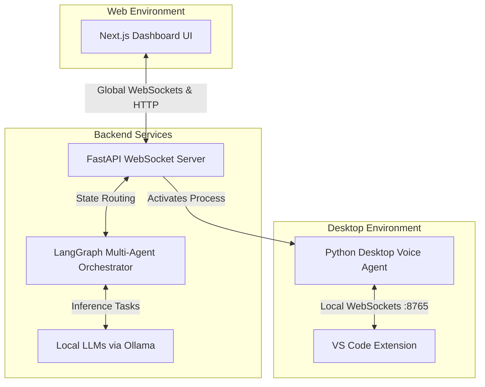
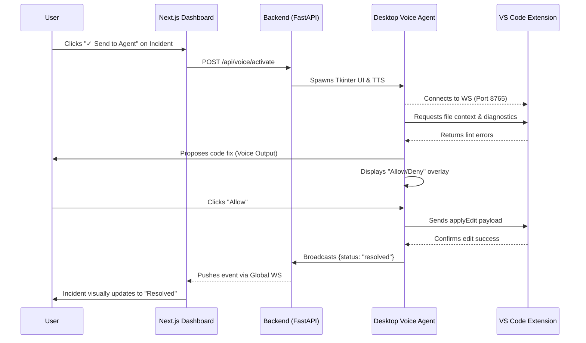

# DevOps Copilot : HACKATHON

DevOps Copilot is an intelligent, reactive incident-response workspace built with a Next.js frontend, a FastAPI/LangGraph backend, and deep IDE integration via a VS Code extension and a desktop Voice Agent.

This README provides a highly detailed, section-by-section breakdown of the entire ecosystem. Use this structure as a foundation for a comprehensive video demonstration script, as it details exactly how the UI behaves and what happens under the hood.

---

## 🏗️ Architecture Overview

The system operates across four primary layers that communicate seamlessly via WebSockets and local HTTP requests to create a unified incident resolution experience.

1. **Frontend (Next.js)**: A dashboard with local persistence (`localStorage`), simulated environments, and live WebSocket subscriptions.
2. **Backend (FastAPI + LangGraph)**: Orchestrates local AI models (via Ollama) and manages global WebSocket states to push real-time updates to the web app.
3. **Voice Agent & Desktop Overlay (Python)**: A desktop assistant using `pygame` and `Tkinter` to provide voice interaction and visual permission prompts natively on the OS.
4. **VS Code Extension (TypeScript)**: Runs a local WebSocket server (port 8765) to stream editor diagnostics to the AI and apply autonomous code modifications.

---

## 🔄 Core Resolution Workflow Diagram

The true power of DevOps Copilot lies in its ability to bridge the browser-based dashboard with the user's local IDE. Below is the sequence diagram detailing the automated fix workflow:

---

## 🎬 Section-by-Section Workflow & Workings

### 1. The Discovery & Landing Page (`/` Route)
* **What it is**: The marketing entry point for the product.
* **How it works**: Uses Framer Motion for scroll-linked animations, fading in feature highlights (e.g., "Diagnose in seconds") and displaying custom SVG visuals. 
* **Video Action**: Scroll through to show the polished UI, then click **"Let's solve ↗"** to enter the main app.

### 2. Incident Inbox & AI Analysis
* **What it is**: The core operations dashboard displaying live alerts.
* **How it works**: 
  - **Data Handling**: Loads a seed array of incidents with metadata (Severity, Payload, Sparkline metrics, Logs).
  - **Simulating Chaos**: Clicking "Simulate new incident" instantly pushes a new SEV2 alert into the state.
  - **Root-Cause Analysis (AI Pane)**: Clicking an incident opens the detail pane. Clicking **"✦ Run Copilot"** sends a `POST` request to `/api/analyze`. The Next.js API routes this to the LLM and streams back a root-cause hypothesis, parsing markdown dynamically into the UI.
* **Video Action**: Filter incidents by SEV1, select the `5xx spike after deploy` incident, and run the Copilot Analysis to generate a hypothesis based on the logs.

### 3. Copilot Support Assistant (Chat Interface)
* **What it is**: An AI chat interface embedded in the dashboard for interactive troubleshooting.
* **How it works**: 
  - **Session Management**: Chat history is persisted in `localStorage`. Users can switch between multiple sessions in the left sidebar.
  - **Multimodal AI**: Users can attach files (e.g., screenshots). The frontend converts these to base64 and sends them to `/api/chat` (powered by Gemini) for visual analysis.
  - **Smart Intent Recognition**: If the user types the word *"ticket"* during the chat, the frontend intercepts the command. It fires off a background request to `/api/chat/summarize` to summarize the entire conversation history, stores the summary, and automatically redirects the user to the Tickets view.
* **Video Action**: Open a chat session, upload a screenshot of an error, ask the agent to troubleshoot it, and finally type "Please open a ticket for this".

### 4. Automated Support Ticketing
* **What it is**: The system for logging user-reported issues.
* **How it works**: 
  - **Seamless Context Handoff**: Upon redirection from the Assistant, the New Ticket form's "Description" field is automatically pre-filled with the AI-generated summary of the previous chat.
  - **Dual Action**: When the ticket is submitted:
    1. It is saved to `localStorage` and a Copilot Ticket Analysis (`/api/ticket`) is generated.
    2. *Crucially*, the system automatically synthesizes a new "Incident" in the main Inbox tied to this ticket, correlating the user's report with simulated backend logs (e.g., `WARN: High latency...`) and recent deployments.
* **Video Action**: Show the pre-filled ticket form. Submit it, watch the Copilot Analysis generate recommendations, and then jump back to the **Incident Inbox** to see the newly correlated alert automatically appear at the top of the queue.

### 5. Workspace Context: On-Call & Integrations
* **What it is**: Auxiliary views to demonstrate enterprise readiness.
* **How it works**: 
  - **On-Call**: Displays active shift rotations and allows for simulated PagerDuty handoffs.
  - **Integrations**: Interactive toggles for Slack, Datadog, AWS, etc., modifying state and showing active connections.
* **Video Action**: Briefly flip through these tabs to demonstrate the platform's holistic context before moving to the resolution phase.

### 6. Voice Agent & VS Code Integration (The Autonomous Fix)
* **What it is**: The system's flagship feature—bridging the web dashboard to the local OS and IDE.
* **How it works**: 
  - **Trigger**: Clicking **"✓ Send to Agent"** on an active incident sends a `POST` request to `http://localhost:8000/api/voice/activate`.
  - **Desktop Wakeup**: The Python backend triggers the `ui_process.py` script, spawning a sleek, floating Tkinter overlay on the user's desktop, and greeting the user via TTS.
  - **IDE Websocket Bridge**: The backend agent connects to the VS Code extension via `ws://localhost:8765`. It sends a `getDiagnostics` command to instantly read the active file's lint errors (e.g., a missing import).
  - **Secure Execution**: The LangGraph AI determines the code fix and sends an `applyEdit` payload. The floating Tkinter UI intercepts this, switching to a verification state with **Allow** and **Deny** buttons.
  - **Global Resolution**: When the user clicks **Allow**, the code edit is applied in VS Code. The backend then pushes a `{status: "resolved"}` event over the global websocket (`ws://localhost:8000/ws/chat/global`). The Next.js frontend catches this and updates the incident row to a glowing green **"Resolved"** state.
* **Video Action**: 
  1. Click "Send to Agent" in the web UI.
  2. Switch to VS Code. Show the floating desktop UI appear.
  3. Speak (or simulate speaking) to the Voice Agent. 
  4. Wait for the Voice Agent to propose a fix based on VS Code diagnostics.
  5. Click "Allow" on the floating UI. Watch the code fix itself autonomously in the editor.
  6. Snap back to the Next.js dashboard to show the incident automatically flipping to "Resolved" with zero manual clicks.
